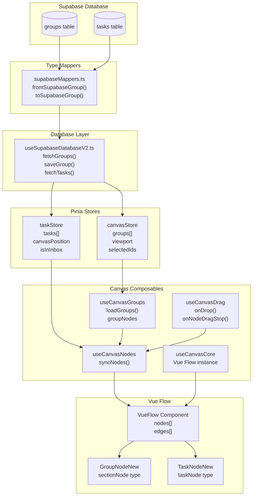
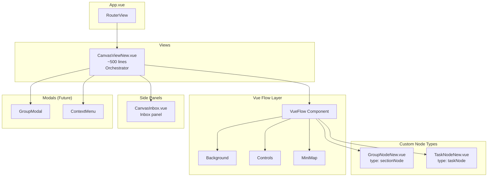
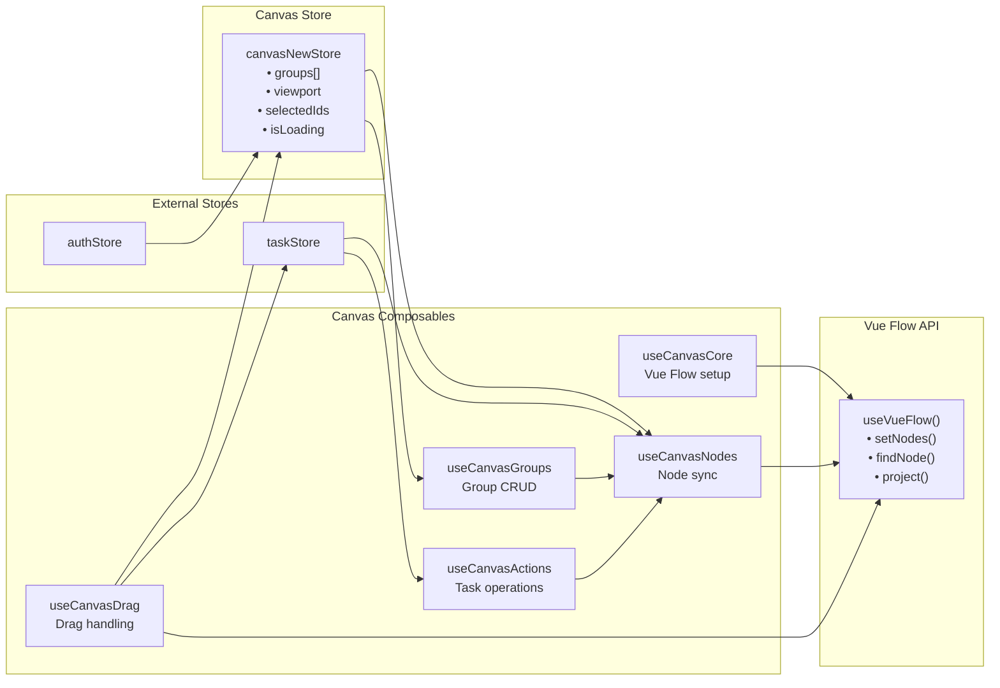
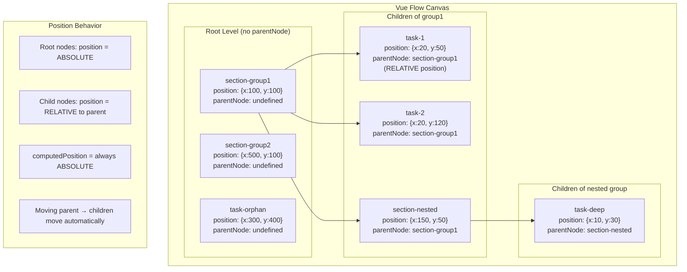
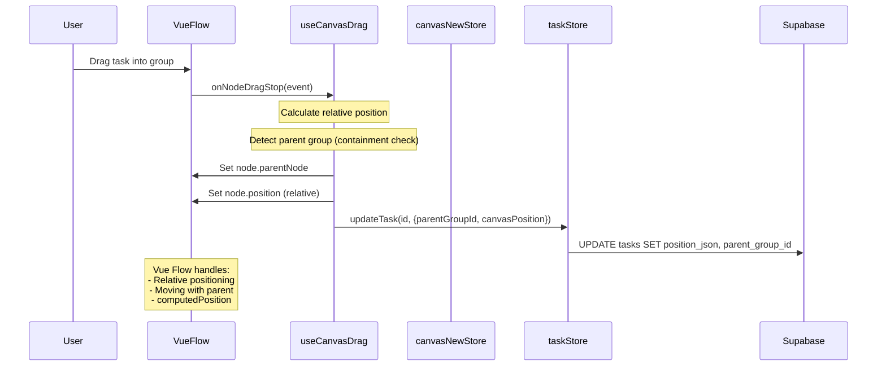
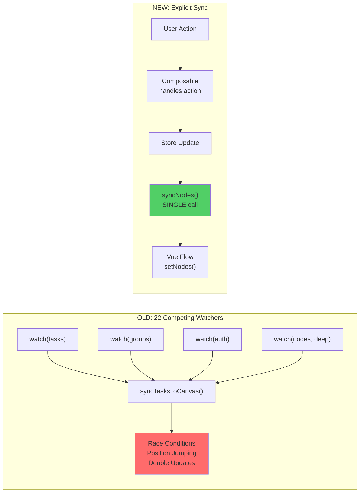

# Canvas Rebuild - Integration Map

This document maps EVERY file in the app that touches the canvas system. Critical for ensuring the new canvas fully replaces the old one with no orphaned references.

---

## Visual Relationship Diagrams

### 1. Data Flow: Supabase → Vue Flow



### 2. Component Hierarchy



### 3. Store & Composable Dependencies



### 4. Parent-Child Node Relationships (Vue Flow)



### 5. External Integration Points

```mermaid
flowchart TB
    subgraph CanvasSystem["Canvas System (to replace)"]
        CS["canvasStore"]
        CV["CanvasView"]
        COMP["23 Composables"]
    end

    subgraph TaskSystem["Task System"]
        TST["taskStore<br/>canvasPosition<br/>isInInbox"]
        TCM["TaskContextMenu<br/>Move to Section"]
        TEM["TaskEditModal<br/>Section assignment"]
        TM["TaskEditMetadata<br/>SectionSelector"]
    end

    subgraph AppInit["App Initialization"]
        AI["useAppInitialization<br/>loads canvas on startup"]
        AS["useAppShortcuts<br/>key '3' → /canvas"]
    end

    subgraph Persistence["Persistence Layer"]
        BS["useBackupSystem<br/>includes groups in backup"]
        CTS["useCrossTabSync<br/>syncs canvas changes"]
    end

    subgraph Modals["Modal System"]
        MM["ModalManager<br/>section assignment"]
        GM["GroupModal<br/>create/edit groups"]
    end

    subgraph Inbox["Inbox System"]
        UIP["UnifiedInboxPanel<br/>drag to canvas"]
        CIP["CalendarInboxPanel<br/>drag to canvas"]
    end

    CS --> TCM
    CS --> TEM
    CS --> TM
    CS --> AI
    CS --> BS
    CS --> CTS
    CS --> MM
    CS --> GM
    CS --> UIP
    CS --> CIP
    TST --> CV
```



### 6. Data Persistence Flow



### 7. Sync Architecture (New vs Old)



---

## Phase 1: Parallel Development (No Breaking Changes)

| File | Action | Notes |
|------|--------|-------|
| `src/views/CanvasViewNew.vue` | CREATE | New canvas, parallel to old |
| `src/stores/canvasNew.ts` | CREATE | New store, parallel to old |
| `src/composables/canvasNew/*` | CREATE | New composables |
| `src/components/canvasNew/*` | CREATE | New components |
| `src/router/index.ts` | ADD ROUTE | `/canvas-new` for testing |

---

## Phase 2: Integration Points Update

### Router
| File | Current | New | Notes |
|------|---------|-----|-------|
| `src/router/index.ts` | `CanvasView.vue` | `CanvasViewNew.vue` | Swap after verification |

### App Initialization
| File | Current Import | New Import |
|------|----------------|------------|
| `src/composables/app/useAppInitialization.ts` | `useCanvasStore` | `useCanvasNewStore` |
| `src/composables/app/useAppShortcuts.ts` | `/canvas` route | No change needed |

### Backup System
| File | Current | New |
|------|---------|-----|
| `src/composables/useBackupSystem.ts` | `canvasStore.loadFromDatabase` | `canvasNewStore.load` |

### Cross-Tab Sync
| File | Current | New |
|------|---------|-----|
| `src/composables/useCrossTabSync.ts` | Canvas sync events | Update to new store |
| `src/composables/useCrossTabSyncIntegration.ts` | Canvas events | Update to new store |

### Task Store
| File | Current | New |
|------|---------|-----|
| `src/stores/tasks.ts` | `canvasPosition` handling | Same interface (compatible) |

---

## Phase 3: Component Dependencies

### Task Components
| Component | Canvas Dependency | Migration |
|-----------|-------------------|-----------|
| `src/components/tasks/TaskContextMenu.vue` | `useCanvasStore` for section list | Swap store import |
| `src/components/tasks/TaskEditModal.vue` | `useCanvasStore` for section assign | Swap store import |
| `src/components/tasks/edit/TaskEditMetadata.vue` | `SectionSelector` | Create `SectionSelectorNew.vue` or keep compatible interface |

### Modal Components
| Component | Canvas Dependency | Migration |
|-----------|-------------------|-----------|
| `src/layouts/ModalManager.vue` | Section assignment logic | Update to new store |
| `src/components/common/GroupModal.vue` | `useCanvasStore` | Swap store import |

### Inbox Components
| Component | Canvas Dependency | Migration |
|-----------|-------------------|-----------|
| `src/components/inbox/UnifiedInboxPanel.vue` | Canvas composables | Update imports |
| `src/components/inbox/CalendarInboxPanel.vue` | Canvas composables | Update imports |

---

## Phase 4: Supabase Integration

**No changes needed to database layer** - new canvas uses same tables and mappers.

| Method | File | Change |
|--------|------|--------|
| `fetchGroups()` | `useSupabaseDatabaseV2.ts` | No change |
| `saveGroup()` | `useSupabaseDatabaseV2.ts` | No change |
| `deleteGroup()` | `useSupabaseDatabaseV2.ts` | No change |
| Type mappers | `supabaseMappers.ts` | Update `CanvasGroup` if needed |

---

## Complete File List by Category

### Store Files (to swap)
- `src/stores/canvas.ts` (827 lines) -> `src/stores/canvasNew.ts`
- `src/stores/canvas/types.ts` (94 lines)
- `src/stores/canvas/canvasInteraction.ts`
- `src/stores/canvas/canvasUi.ts`

### View Files (to swap)
- `src/views/CanvasView.vue` (3,468 lines) -> `src/views/CanvasViewNew.vue`

### Composables (23 files to replace with 5)
```
src/composables/canvas/
├── useCanvasActions.ts (518 lines)
├── useCanvasAlignment.ts (356 lines)
├── useCanvasConnections.ts (134 lines)
├── useCanvasContextMenus.ts (97 lines)
├── useCanvasDragDrop.ts (1,249 lines)
├── useCanvasEvents.ts (250 lines)
├── useCanvasFilteredState.ts (113 lines)
├── useCanvasFiltering.ts (98 lines)
├── useCanvasGroupMembership.ts (90 lines)
├── useCanvasHotkeys.ts (80 lines)
├── useCanvasInteractionHandlers.ts (357 lines)
├── useCanvasModals.ts (82 lines)
├── useCanvasNavigation.ts (55 lines)
├── useCanvasOverdueCollector.ts (264 lines)
├── useCanvasParentChild.ts (222 lines)
├── useCanvasResize.ts (362 lines)
├── useCanvasResourceManager.ts (219 lines)
├── useCanvasSelection.ts (261 lines)
├── useCanvasSmartGroups.ts (9 lines)
├── useCanvasSync.ts (914 lines)
├── useCanvasZoom.ts (149 lines)
├── useMidnightTaskMover.ts (112 lines)
└── useNodeAttachment.ts (226 lines)
```

### Components (25 files to replace with 3)
```
src/components/canvas/
├── CanvasContextMenu.vue (764 lines)
├── CanvasContextMenus.vue (108 lines)
├── CanvasControls.vue (72 lines)
├── CanvasEmptyState.vue (95 lines)
├── CanvasGroup.vue (818 lines)
├── CanvasLoadingOverlay.vue (57 lines)
├── CanvasModals.vue (141 lines)
├── CanvasSelectionBox.vue (36 lines)
├── CanvasStatusBanner.vue (44 lines)
├── CanvasStatusOverlays.vue (102 lines)
├── CanvasToolbar.vue (134 lines)
├── EdgeContextMenu.vue (151 lines)
├── GroupEditModal.vue (419 lines)
├── GroupManager.vue (794 lines)
├── GroupNodeSimple.vue (629 lines)
├── GroupSettingsMenu.vue (516 lines)
├── InboxFilters.vue (489 lines)
├── InboxPanel.vue (848 lines)
├── InboxTimeFilters.vue (322 lines)
├── MultiSelectionOverlay.vue (550 lines)
├── ResizeHandle.vue (177 lines)
├── SectionSelectionModal.vue (213 lines)
├── SectionSelector.vue (306 lines)
├── TaskNode.vue (1,152 lines)
└── UnifiedGroupModal.vue (960 lines)
```

### Utilities (to delete)
- `src/utils/canvasStateLock.ts`
- `src/utils/canvasGraph.ts`
- `src/utils/canvasBusinessLogic.ts`
- `src/utils/canvas/positionUtils.ts`
- `src/utils/canvas/NodeUpdateBatcher.ts`

### Test Files (to update)
- `src/stores/__tests__/canvas.test.ts`
- `src/composables/canvas/__tests__/useMidnightTaskMover.spec.ts`
- `tests/canvas-*.spec.ts` (all E2E tests)
- `src/stories/helpers/mockUseCanvasStore.ts`

### Other Dependent Files
- `src/composables/useVueFlowStateManager.ts`
- `src/composables/undoSingleton.ts`
- `src/composables/useGroupSettings.ts`
- `src/composables/tasks/useTaskEditActions.ts`
- `src/composables/useDynamicImports.ts`

---

## Migration Checklist

Before swapping, verify each integration point:

- [ ] Router updated
- [ ] App initialization updated
- [ ] Backup system updated
- [ ] Cross-tab sync updated
- [ ] Task context menu works
- [ ] Task edit modal works
- [ ] Modal manager works
- [ ] Unified inbox panel works
- [ ] All E2E tests pass
- [ ] No console errors referencing old canvas
